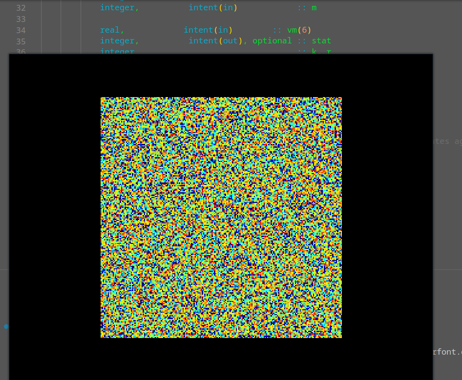
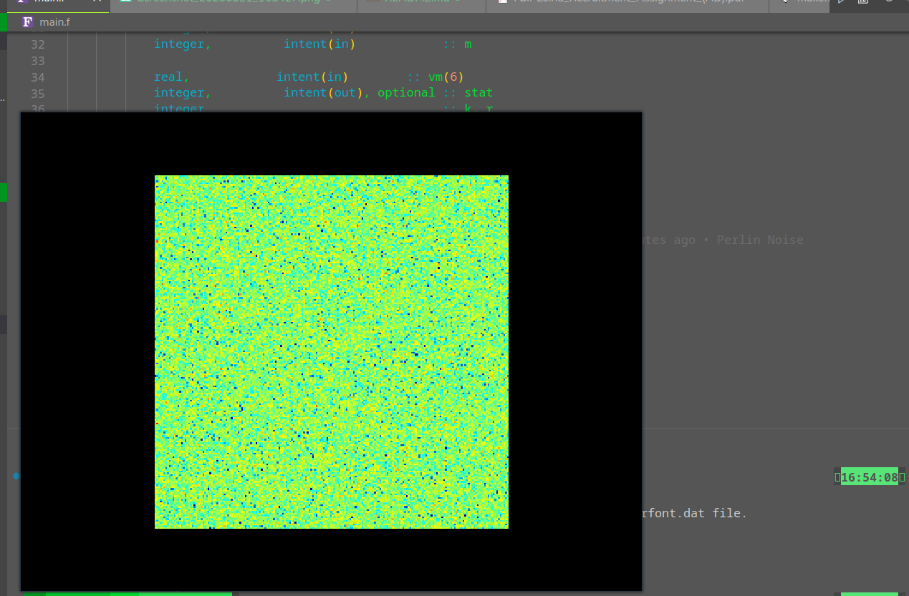
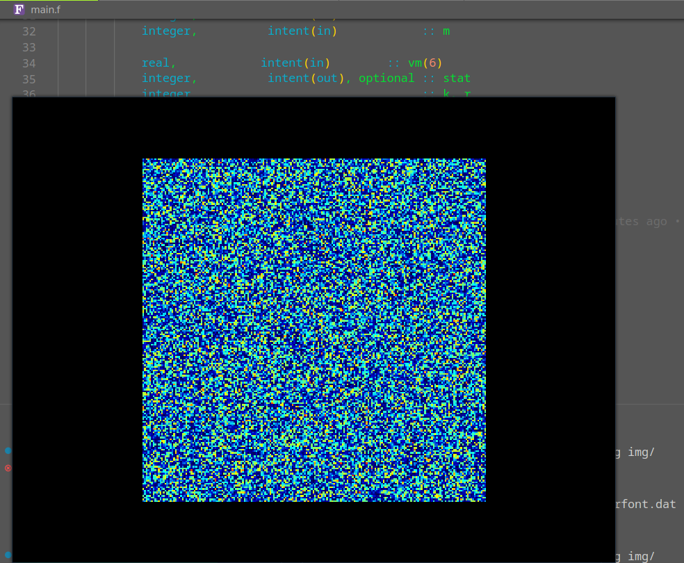

# Fortran Learn

Why hello! if you wondered here welcome to this repo this is just a repo for me to test out fortran lang and its features and perks. As usual i love doing random distribution/numbers so if everything goes to plan there will be some pictures i took from results

A "purely random" distribution:

Its not truly pure(very few things cant be predicted given enough time and eyesight)... and im pretty shure its always hitting the same seed

Heres a normal distribution 

And finally heres the perlin noise i guess

